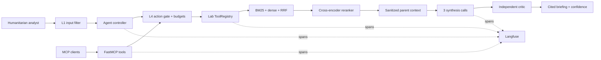

# Architecture

## Trust boundaries

- User text is untrusted until L1 normalization and injection checks pass.
- PDF text is untrusted even though its publisher is reputable. Sanitization occurs
  at ingestion and again immediately before context assembly.
- L4 authorizes every tool. Unknown tools default to human confirmation.
- `store_finding` is monitored and accepts only a short, non-instructional finding.
- The final answer is advisory and always exposes its critic verdict and provenance.

## Non-obvious design decision

Retrieval operates on small child chunks, while reranking and synthesis receive the
larger parent block. Small children make specific figures easier to retrieve; larger
parents preserve definitions, caveats, and the distinction between observed counts
and modelled risk. The cost is more context per answer, controlled by a four-parent
limit and the token budget.
